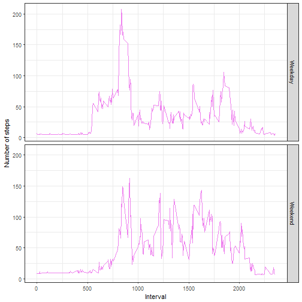

#Programming Assignment PA1_Template 
Author : Mukund

## Introduction
This assignment makes use of data from a personal activity monitoring device. This device collects data at 5 minute intervals through out the day. The data consists of two months of data from an anonymous individual collected during the months of October and November, 2012 and include the number of steps taken in 5 minute intervals each day.

##Data
The data for this assignment can be downloaded from the course web site:

Dataset: Activity monitoring data [52K]
The variables included in this dataset are:

* steps: Number of steps taking in a 5-minute interval (missing values are coded as NA)
* date: The date on which the measurement was taken in YYYY-MM-DD format
* interval: Identifier for the 5-minute interval in which measurement was taken
The dataset is stored in a comma-separated-value (CSV) file and there are a total of 17,568 observations in this dataset.

#My Submission

## Loading and preprocessing the data


```r
data <- read.csv("activity.csv")
```

## Loading Libraries


```r
library(ggplot2)
library(scales)
library(reshape2)
```


## Process/transform the data (if necessary) into a format suitable for your analysis


```r
data$date <- as.Date(data$date, format = "%Y-%m-%d")
```

## Step 1 -  What is mean total number of steps taken per day?

```r
totalstepstaken <- aggregate(steps ~ date, data, sum)
```

## Step 2 - Make a histogram of the total number of steps taken each day


```r
ggplot(totalstepstaken, aes(x = steps)) + geom_histogram(fill = "blue", binwidth = 1000) + 
      labs(title="Histogram of Total Steps Taken each Day", x = " Total Number of Steps each Day", y = "Count") +         theme_bw()  
```


## Step 3 - Calculate and report the mean and median of the total number of steps taken per day


```r
meanstepsbyday <- mean(totalstepstaken$steps, na.rm=TRUE)
medianstepsbyday <- median(totalstepstaken$steps, na.rm=TRUE)

sprintf("Mean number of steps taken everyday = %.2f", meanstepsbyday)
```

```
## [1] "Mean number of steps taken everyday = 10766.19"
```

```r
sprintf("Median number of steps taken everyday = %.2f ", medianstepsbyday)
```

```
## [1] "Median number of steps taken everyday = 10765.00 "
```


## What is the average daily activity pattern?

## Step 1 - Find the steps per  5 minute interval 


```r
steps_per_interval <- aggregate(x = list(steps = data$steps), 
                                by = list(interval = data$interval),
                                FUN=mean, na.rm=TRUE)
```

## Step 2 - Make a time series plot (i.e. type = "l") of the 5-minute interval (x-axis) and the average number of steps taken, averaged across all days 


```r
ggplot(steps_per_interval, aes(x=interval, y=steps)) +   
  geom_line(color="orange", size=1) +  
  labs(title="Average Daily Activity Pattern", x="Interval", y="Number of steps") +  
  theme_bw()
```


## Step3 - Which 5-minute interval, on average across all the days in the dataset, contains the maximum number of steps?


```r
which_max_interval <- steps_per_interval[which.max(steps_per_interval$steps),1]

sprintf(" Which interval acorss all days is max step = %.2f", which_max_interval)
```

```
## [1] " Which interval acorss all days is max step = 835.00"
```


## Imputing missing values
## Step 1 - Calculate and report the total number of missing values in the dataset (i.e. the total number of rows with NAs)


```r
missingvals <- sum(is.na(data$steps))
print(missingvals)
```

```
## [1] 2304
```

## Step - 2 - Devise a strategy for filling in all of the missing values in the dataset. The strategy does not need to be sophisticated. For example, you could use the mean/median for that day, or the mean for that 5-minute interval, etc.

## Step -3 - Create a new dataset that is equal to the original dataset but with the missing data filled in.

Here we use Casting the dataset by interval  and merging original dataset and recasted data set so that NA is 
is replaced by recasted dataset entries. We use mean while recasting dataset. We find which indices in original  data set is NA and replace that with mean entries of the same index from merged data set.


```r
activityMeltedInterval <- melt(data, id.vars="interval", measure.vars="steps", na.rm=TRUE)
activityCastedInterval <- dcast(activityMeltedInterval, interval ~ variable, mean)
activityMergeInterval  = merge(data, activityCastedInterval, by =  "interval",suffixes=c(".x", ".y"))
na_index <- which(is.na(data$steps))
data[na_index,"steps"] = activityMergeInterval[na_index,"steps.y"]
```

## Step 4 - Make a histogram of the total number of steps taken each day and Calculate and report the mean and median total number of steps taken per day. 

Do these values differ from the estimates from the first part of the assignment? What is the impact of imputing missing data on the estimates of the total daily number of steps?

Here we  cast the datawithout NA, set by date; set by sum


```r
actMeltDate <- melt(data, id.vars="date", measure.vars="steps", na.rm=FALSE)
actCastDate <- dcast(actMeltDate, date ~ variable, sum)

ggplot(actCastDate,aes(x = steps)) + 
  geom_histogram(fill = "blue",binwidth = 1000) +
  labs(title="Histogram of Total Steps Taken each Day",  x = " Total Number of Steps each Day", y = "Count") + theme_bw() 
```


## Mean and Median calculated for imputed data


```r
paste("Mean daily steps =", mean(actCastDate$steps, na.rm=TRUE)) 
```

```
## [1] "Mean daily steps = 10889.7992576554"
```

```r
paste("Median daily steps =", median(actCastDate$steps, na.rm=TRUE)) 
```

```
## [1] "Median daily steps = 11015"
```

##Are there differences in activity patterns between weekdays and weekends?
## Step 1 - Create a new factor variable in the dataset with two levels - "weekday" and "weekend" indicating whether a given date is a weekday or weekend day.


```r
weekend_days_set <- c("Saturday", "Sunday")
data$dayofWeek = as.factor(ifelse(is.element(weekdays(as.Date(data$date)),weekend_days_set), "Weekend", "Weekday"))
```

##Step 2 - Make a panel plot containing a time series plot (i.e. type = "l") of the 5-minute interval (x-axis) and the average number of steps taken, averaged across all weekday days or weekend days (y-axis). 


```r
averagedActivityDataImputed <- aggregate(steps ~ interval + dayofWeek, data= data, mean)
ggplot(averagedActivityDataImputed, aes(x=interval, y=steps)) + 
  geom_line(color="violet") + 
  facet_grid(dayofWeek ~.) +
  labs(x="Interval", y="Number of steps") +
  theme_bw()
```


